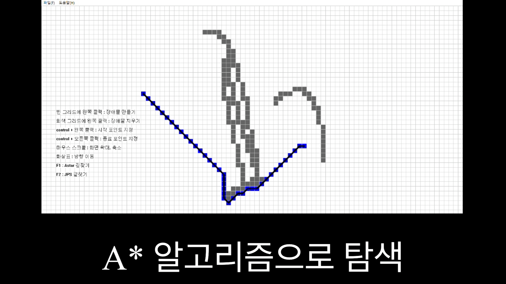

<h1>📜 윤일식 포트폴리오</h1>

 
 
<h2>👋 Intro</h2>

안녕하세요! "항상 새로운 것을 배우고 도전하는" 윤일식입니다

MMORPG 게임 서버를 만들기 위해 공부해왔습니다

 
 
 
<h2>📝Projects</h2>

게임 서버를 공부하면서 만들었던 개인 프로젝트입니다.

주어진 코드는 없었고 전부 경험해나가며 구현했습니다.

모든 프로젝트는 단순 구현에서 그치지 않고 더 많은 접속자를 처리하기 위해 최적화 했습니다.

 
 
 
<h2>1.  메인 서버 분산 설계</h2>
<h3>네트워크 라이브러리 - 로그인 - Redis - 채팅(존 방식 구현) - 모니터링 - DB 구조의 전체 서버 (15000명 연결 유지 테스트)</h3>
 

개발기간 : 2025.05.27-07.10

 

Language : C++

Skill : Redis, MySql, IOCP, Multithread

<a href="https://github.com/IlsIkYoon/ChatMultiServer" target="_blank">🔗 프로젝트 보러 가기</a>

 
 
 

<h2>2. 게임 컨텐츠 서버</h2>
<h3>동시 접속 7000명 수용의 MMO환경 서버. 생성, 섹터 이동, 공격, 사망 처리, 존 방식으로 구현</h3>
 

개발기간 : 2024.11.28-2025.03.16

 

Language : C++

Skill : Select, Sector

<a href="https://github.com/IlsIkYoon/TCP_Fighter_report" target="_blank">🔗 프로젝트 보러 가기</a>
 
 

아래 이미지를 클릭하면 영상으로 이동합니다

 
 
 

<h2>3. 길찾기 GUI </h2>
<h3>A*, JPS를 이용한 길찾기 구현 및 GUI 시각화</h3>
 

개발기간 : 2024.11.16-2025.01.13

 

Language : C++

Skill : A*, JPS

<a href="https://github.com/IlsIkYoon/FindingWayProgram_report" target="_blank">🔗 프로젝트 보러 가기</a>
 
 

아래 이미지를 클릭하면 영상으로 이동합니다

 
 
 
<h2>4. Lock-Free Queue</h2>
<h3>네트워크 라이브러리에서 사용하기 위한 락프리 큐 직접 구현</h3>

 

개발기간 : 2025.03.24-28

 

Language : C++

Skill : MultiThread, Debugging

<a href="https://github.com/IlsIkYoon/LockFreeQ" target="_blank">🔗 프로젝트 보러 가기</a>
 
 
 

<h2>5. 모니터링 클라이언트</h2>
<h3>모니터링 데이터를 실시간으로 확인하기 위한 클라이언트 구현</h3>

 

개발기간 : 2025.07.22

 

Language : C#

Skill : .NET Winform

<a href="https://github.com/IlsIkYoon/Winform-practice" target="_blank">🔗 프로젝트 보러 가기</a>

 
 
 
<h2>📞 Contact<h2></h2>
  
이메일 : ilsik95@naver.com

  
블로그 : https://blog.naver.com/ilsik95

